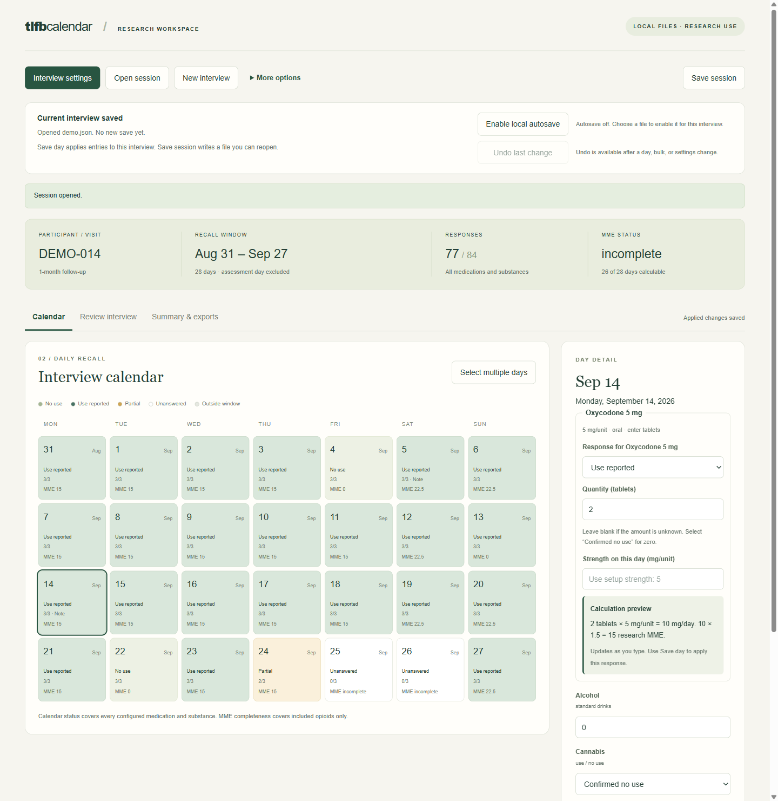

# TLFB Calendar

**An offline desktop app for Timeline Followback (TLFB) interviews that tracks daily
opioid medication use and calculates morphine milligram equivalents (MME) for research.**
Interviewers walk a participant through a calendar of recent days, record substance use
and opioid doses, and export clean, analysis-ready CSVs. Missing days are never counted as zero.



> **Research use only.** MME values are research estimates. They are not prescribing,
> opioid-rotation or OUD dosing guidance.

## Who it's for

Research teams running TLFB interviews in pain, opioid-use or substance-use studies who need
daily opioid exposure in MME, alongside alcohol, cannabis, nicotine or any other substance.

- **Two conversion tables:** CDC 2022 (default) or the NIH HEAL Initiative research table, chosen per interview.
- **Honest missingness:** unanswered, unknown amount and confirmed zero are kept distinct everywhere.
- **Shows its work:** every dose shows its calculation as you type, and every export row carries the strength, factor and reason.
- **Handles hard cases:** combination products, liquids, fentanyl and buprenorphine patches, Sublocade injections, pain pumps, methadone for pain or OUD.
- **Offline by design:** no internet connection, account, telemetry or cloud storage. Files are saved only where you choose.

## Download and install (Windows)

1. Download `TLFB-Calendar-…-Windows-x64-Setup.exe` from the [latest release](../../releases/latest).
2. Run it. Windows may show **"Windows protected your PC"** because the installer is not
   code-signed yet. Click **More info**, then **Run anyway**. On institution-managed computers,
   ask IT before installing, and don't bypass your institution's policy.
3. Open **TLFB Calendar** from the Start menu or desktop. Nothing else needs to be installed.

Windows 10/11 (64-bit). There is no macOS version yet.

New to the app? Start with the [staff quick start](docs/STAFF_GUIDE.md) and try
**More options → Try synthetic demo**. Use synthetic data until your study team has
reviewed the calculation methods and approved where session files are stored.

## Documentation

- [Staff quick start](docs/STAFF_GUIDE.md)
- [Research calculation specification](docs/RESEARCH_SPEC.md): factors, exceptions and conventions
- [Offline design and verification](docs/OFFLINE_REVIEW.md)
- [Project plan](docs/IMPLEMENTATION_PLAN.md) and [status](docs/PROGRESS.md)

## Citing

If you use TLFB Calendar in research, please cite it. GitHub's **Cite this repository**
button (from [CITATION.cff](CITATION.cff)) provides APA and BibTeX formats. Please also cite the
TLFB method (Sobell & Sobell, 1992) and the MME conversion table you used.

## Status

A research prototype with 108 checks: 80 automated tests covering
calculations and data handling, plus 28 desktop workflow checks.

Testing uses synthetic data on a Windows development computer.
Testing on a separate clean computer and study-specific validation
are still pending. The app has not yet been used with participants
or approved by an institution.

Research use only—not for prescribing or treatment decisions.

Created by Kobe Hanson. MIT license.

## Features

- Assessment date, 1–90 recall days (assessment day excluded), assessor and visit name.
- Baseline, 1-, 3-, and 6-month visits, plus custom appointment labels.
- Up to 30 medication records and 12 other substances, with explicit units.
- Oral tablet, capsule, liquid and direct-mg entry; documented fentanyl patch wear.
- Daily strength overrides; unknown quantity/strength preserved for review.
- Weekday/weekend/manual date selection, overwrite confirmation and event notes.
- Distinct confirmed zero, reported use, partial, unanswered and outside-window days.
- Total, maximum and daily-average MME; calendar-month summaries within the recall interval.
- Choice of MME conversion table per interview: CDC 2022 (default) or the NIH HEAL Initiative research table.
- Buprenorphine reported separately under CDC; under NIH HEAL, buprenorphine for pain enters MME and OUD buprenorphine gets its own separate MME subtotal. Injections, pumps and unsupported routes excluded from MME.
- Native local JSON session save/open, combined daily/summary CSVs and six detailed CSV exports.
- Live dose/MME previews, last-save time and filename, optional local autosave.
- Undo the last applied day, bulk-entry/clearing or settings change.
- Version-1 session import without guessing opioid identities or converting old free text.

## Data handling

The desktop app loads bundled files with Electron. It does not run a localhost
server or include an AI client, automatic upload, telemetry, cloud database,
automatic recovery file, or updater. Remote requests, navigation, popups and
permissions are blocked. Interview state stays in memory until explicitly saved/exported or saved by
local autosave after the researcher enables it and chooses a file. Native file dialogs select destinations. JSON/CSV files contain the
entered data, including notes; they are not encrypted by the app. A chosen folder
may itself be cloud-synced by Windows/OneDrive, so use approved storage.

Save day updates the open interview. Save session writes the resumable file.
Optional autosave writes applied changes after a short delay to the chosen file.
Unapplied day/settings drafts are not autosaved. Autosave starts off for every
new/opened interview; its chosen path is kept only in the main-process memory.
Canceled or failed saves do not mark an interview saved. Individual CSV exports do not replace a
session backup; Save export folder also includes a resumable JSON copy. Sudden shutdown can lose changes that have not been saved.

REDCap remains a separate downstream workflow. There is no REDCap API or embedded
REDCap instrument. The original workbook and participant data are not distributed.

## Research definitions

Each interview stores one frozen reference, chosen in setup: the
[CDC 2022 conversion table](https://www.cdc.gov/mmwr/volumes/71/rr/rr7103a1.htm#T1_down) (default) or the
[NIH HEAL Initiative MME mapping table](https://pmc.ncbi.nlm.nih.gov/articles/PMC12266977/),
each with its own application policy version. Changing the table keeps every answer and recalculates. MME is research output, not a
prescribing or opioid-rotation recommendation. See the specification for factors
and exceptions.

All-days averages, full-period totals and maxima require every included-opioid
day to be calculable. Answered-day averages use only fully calculable days;
reported use of unknown quantity is recorded but excluded from that denominator.
Confirmed zero-use days count as zero. Incomplete periods show explicitly labeled
observed values/subtotals. No included opioid means MME is not applicable.

Calendar status includes every medication and substance, independently of MME
eligibility. Monthly results use only recall dates within each calendar month.
Values are not extrapolated to 30 days. Under CDC, buprenorphine is never assigned an MME
factor; under NIH HEAL, pain buprenorphine is included and OUD buprenorphine is a separate
subtotal outside the totals. Oral methadone for pain or OUD uses 4.7 in both tables; fentanyl requires confirmed 24-hour
concurrent patch wear. Different units are never added together.

Version 0.1.2 includes OUD methadone under research policy 2, accepts mg per injection
(e.g., one reported 300 mg Sublocade administration), and records pump delivery.
BUP remains outside MME; its reported dose in mg is included in summaries/exports.
Older policy-1 sessions display an upgrade notice and keep their reported data.
Save a new session copy and regenerate CSVs; previous versions cannot open policy 2.

Version 0.1.3 adds calculation previews using the same engine as exports, a last-save
indicator, optional local autosave and one-step undo. Calculation policy 2 and the
session/CSV formats are unchanged. Undo history stays in memory and resets when
an interview is opened/replaced; saving/exporting does not erase it.

Version 0.1.4 adds an interview review with date links, optional medication detail,
follow-up setup copying, date-range selection, a three-file export folder and a
printable summary. The calendar keeps its existing styling; additional tables
and individual exports are collapsed until needed. BUP and pump doses stay optional.
Session version 2 and MME policy 2 are unchanged. Combined summary CSV schema 3
adds per-medication contributions and a separately labeled OUD-methadone subtotal.

## Export files

**Save export folder** writes a new folder containing the session JSON, combined daily CSV
and combined summary CSV. Names share the participant, visit and assessment date;
repeated exports get distinct folders. **Print summary** opens the native print
dialog with a compact report including notes. Printing does not save the session.

For MME and other substances together, use **Summary & exports → Individual CSV files → Combined daily CSV**
(one row per date) or **Combined summary CSV** (one row per interview with window/month
MME statistics and each substance's use/missing/zero days and reported quantities).
Both retain explicit missingness and separate buprenorphine from MME. Numbered
medication/substance column groups follow interview setup order and include IDs,
names and units; use those identifiers when combining files from different setups.

The UI offers substance daily/summary, medication daily, MME daily/summary and
buprenorphine CSVs. Each includes appointment metadata and explicit missingness;
MME exports carry reference/policy identifiers. Medication rows preserve raw
quantity, units, effective strength, overrides, patch hours, factors and reasons
for exclusions/review. Formula-like CSV text is neutralized for spreadsheets.
CSV values retain calculation precision; the screen rounds to two decimal places.
JSON contains the versioned reference snapshot and reopens the whole interview.

Settings preserve compatible responses on overlapping dates. Changing measurement
definitions or removing populated dates/items requires confirmation before those
responses are cleared. Use per-day strength overrides for dose changes.

## Build or replicate from source

Requires Node.js 22.18+ (tested with 24.18) and npm. Internet is needed to acquire
development dependencies and packaging tools, not to run the installed app.

```sh
npm ci
npm run desktop
```

On Windows PowerShell, use `npm.cmd` if `npm.ps1` is blocked by execution policy.
If your npm install-script policy skipped Electron's binary installer, review and
allow the Electron installation script before building.

```sh
npm test
npm run typecheck
npm run lint
npm run build:desktop
npm run test:desktop
npm run package:windows
```

The installer is written to `release/`. No publish step is run. Updates are manual:
save sessions, close the app, install a reviewed new version, then reopen sessions.
Regenerating the checked-in icon uses `python desktop/make-icon.py` and Pillow;
ordinary builds do not require Python.

Use `npm run desktop` to build and open the app locally during development.
There is no web or server build. Packaging uses an explicit file allowlist.
Only synthetic fixtures belong in this repository.

## Code map

- `app/`: calendar, setup, response controls and research summary.
- `lib/research-session.ts`: validation and legacy migration.
- `lib/mme.ts`, `lib/mme-reference.ts`: pure calculations and pinned factors.
- `lib/research-exports.ts`: generic research CSVs.
- `lib/workspace.ts`: editing, response preservation and completeness rules.
- `desktop/`: static renderer, sandboxed shell, preload and file policy.
- `tests/`: synthetic domain and running-desktop acceptance checks.

MIT license. See [LICENSE](LICENSE).
